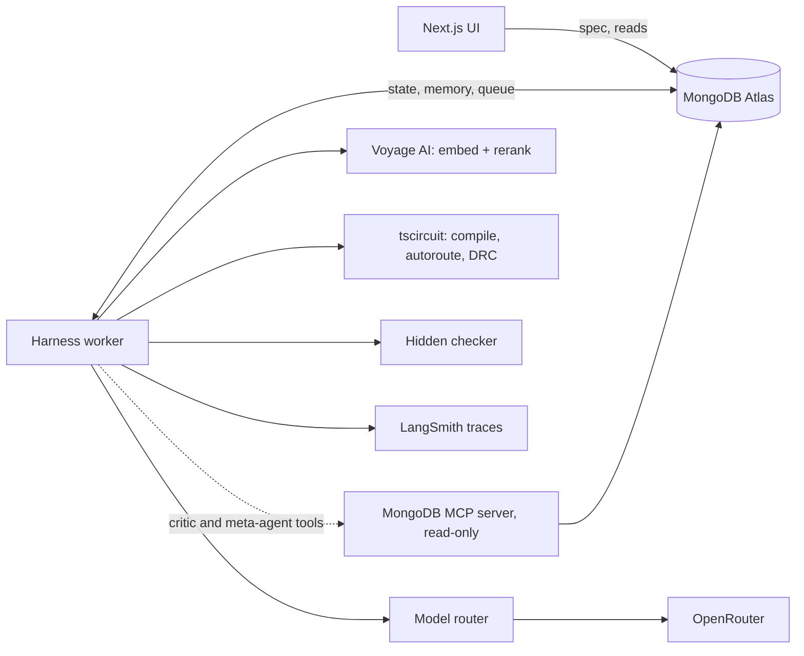

# Ripple: Design Doc

> A self-improving harness that designs circuit boards from a spec, checks them against a hidden spec it never sees, and redesigns itself based on what fails.
>
> Built at the MongoDB Harness Engineering & Model Wrangling Hackathon, Sept 26, 2026.

**Thesis:** the model doesn't get smarter; the harness does.

---

## 1. Overview

Ripple has two layers.

- **The harness** turns an English spec (for example, "read a temperature sensor over I2C, powered from USB-C, with a status LED") into a routed PCB written in [tscircuit](https://tscircuit.com). Agents plan, write, and repair the board; deterministic tools compile, autoroute, and check it; verified subcircuits go into a reusable library.
- **The meta-harness** treats the harness itself as something to optimize. It runs batches of specs, reads the failures, proposes changes to the harness config (rules, context policy, tool access, workflow, model routing), and keeps a change only if scores improve on the next batch.

MongoDB Atlas is the memory and state layer for both: every spec, board, subcircuit, run, lesson, and harness config version lives there.

### Problem statements

| Statement | How Ripple addresses it |
|---|---|
| **One: Recursive Harnessing** | The harness config is a versioned document. A meta-agent rewrites its rules, context policy, tool access, workflow, and model routing; a config gate keeps, rolls back, or rejects each change. |
| **Two: Long Horizon Engineering** | Large boards are split into a work queue of subcircuits, built and verified step by step, checkpointed throughout, and resumable after a crash. Context never grows: every call is rebuilt from Atlas. |

---

## 2. Goals

### Hackathon goals
1. A working end-to-end loop: spec in, routed PCB out, graded by hidden checks.
2. A harness config that measurably improves itself across generations, with changes that were kept, rolled back, and rejected all visible.
3. An ablation showing the same model performing better under the evolved harness than with no harness or the v0 harness, on held-out specs.
4. A long-horizon finale board built from a work queue that survives a kill-and-restart.
5. A 3-minute live demo and a 1-minute submission video.

### Product goals
- Catch the mistakes behind most first-board respins (missing pull-ups, missing decoupling, unconnected pins, routing errors) before manufacturing.
- Make each new board cheaper to design than the last through a growing subcircuit library and learned lessons.
- Keep every design decision traceable to the rule, lesson, or config version that caused it.

### Non-goals
- Proving a board works on real hardware. The checks prove spec and rule compliance, not function.
- High-speed or signal-integrity-sensitive designs.
- Boards beyond 2 layers or roughly 20 parts.
- Training or fine-tuning models.

---

## 3. Architecture



- **One writer:** only the worker writes design state. The UI and MCP server use a read-only database user.
- **Hidden checks** live in `checks/` files, never in the database, so neither the agents nor the read-only user can see them.
- **Live updates:** the local demo server streams Atlas change streams to the UI; the Vercel deployment polls instead, because serverless functions can't hold a stream open.

### Agents

| Agent | Job | Model tier | Triggered by |
|---|---|---|---|
| Planner | Splits a spec into subcircuits and orders the work queue | Strong | New spec, or a repair budget running out |
| Coder | Writes tscircuit code for one work item, reusing library subcircuits | Cheap | Queue item ready, or a critic fix |
| Critic | Diagnoses failures, proposes the smallest fix, writes lessons | Strong | A run failing any check |
| Meta-agent | Proposes harness config changes from batch results | Strong | A batch of boards finishing |

Deterministic components: checker, tscircuit compiler and autorouter, metrics, config gate, model router, worker and work queue, assembler.

### The design loop
1. Retrieve relevant subcircuits and lessons (Vector Search + rerank).
2. Coder writes tscircuit code.
3. Compile to Circuit JSON; autoroute; run DRC.
4. Hidden checker grades connectivity, design rules, and (optionally) SPICE.
5. On failure, the critic proposes a fix, up to the repair budget.
6. On success, save the subcircuit to the library; the assembler combines finished items.

### The meta-harness loop
1. Run a batch of training specs under the current config.
2. Meta-agent reads failures and proposes a config change with a rationale.
3. Config gate tests it on the next batch: **kept** if scores improve, **rolled back** if they drop, **rejected** if it weakens a check.
4. Every version, score, and verdict is stored in `harness_versions`.
5. Ablation on held-out specs: bare model vs. v0 vs. evolved.

### What the harness config controls

| Component | Example change |
|---|---|
| Rules and guardrails | Add "I2C lines need pull-up resistors" |
| Context policy | Retrieve 2 subcircuits instead of 5 |
| Tool access | Block autorouting until connectivity passes; grant or revoke read-only MCP tools per agent |
| Workflow | Plan first for boards over 12 parts |
| Repair budget | 3 attempts before escalating to the planner |
| Model routing | Cheap model codes; strong model critiques and plans |

---

## 4. Data model (MongoDB Atlas)

| Collection | One document is | Notes |
|---|---|---|
| `harness_versions` | a harness config | version, parent, scores, verdict, rationale |
| `specs` | a board task | spec text, train or held-out split; no check contents |
| `subcircuits` | a verified building block | code, embedding, checks passed, reuse count; vector index |
| `boards` | a board version | code, Circuit JSON, metrics, harness version, subcircuits used |
| `work_queue` | a step of a large board | status, dependencies, heartbeat |
| `runs` | one call or tool result | structured result, cost, model; the replayable trace; vector index on failures |
| `lessons` | a learned design rule | pattern, fix, embedding, how often it helped; vector index |

Atlas features used: Vector Search (memory and retrieval), versioned documents (config evolution and rollback), change streams (triggering the critic and meta-agent), multi-document transactions and idempotent upserts (crash-safe work queue).

If the Sandbox is an M0 cluster: at most 3 vector indexes (`subcircuits`, `lessons`, `runs`), and batch writes during the ablation (100 ops/sec limit).

### Contracts (frozen at kickoff)

<details>
<summary><code>HarnessConfig</code></summary>

```json
{
  "version": 4,
  "parent": 3,
  "rules": ["I2C lines need pull-up resistors"],
  "context": { "subcircuits_k": 2, "lessons_k": 5, "rerank": true, "include_last_failure": true },
  "tools": { "route_requires_connectivity": true, "parts_whitelist": "v2",
             "mcp": { "critic": ["find", "aggregate"], "meta": ["find", "aggregate"], "coder": [] } },
  "workflow": { "plan_first": true, "repair_budget": 3, "split_over_parts": 12 },
  "routing": { "planner": "strong", "coder": "cheap", "critic": "strong", "meta": "strong" },
  "scores": { "checks_passed": 0.82, "attempts_per_board": 2.4, "cost_per_board_usd": 0.31 },
  "verdict": "kept",
  "rationale": "Missing pull-ups caused 4 of 9 failures in batch 3"
}
```
</details>

<details>
<summary><code>RunResult</code></summary>

```json
{
  "board_id": "b_017",
  "harness_version": 4,
  "stage": "checks",
  "passed": false,
  "failures": [{ "check": "decoupling", "detail": "U2 VDD has no cap within 3mm" }],
  "drc_errors": 0,
  "metrics": { "area_mm2": 812, "vias": 6, "trace_mm": 214, "bom_usd": 4.12 },
  "model": "cheap",
  "tokens": 5120,
  "cost_usd": 0.004,
  "ts": "2026-09-26T13:12:05Z"
}
```
</details>

Values are illustrative.

---

## 5. Tech stack

| Layer | Choice |
|---|---|
| Language | TypeScript on Node 22.13+ |
| PCB toolchain | tscircuit (pinned version) |
| Agent loop | Vercel AI SDK (or LangGraph.js if chosen at kickoff) |
| Models | OpenRouter, routed per agent by the harness config |
| Embeddings and rerank | Voyage AI |
| Database | MongoDB Atlas Hackathon Sandbox |
| Agent data access | MongoDB MCP server, read-only |
| Tracing | LangSmith, plus `runs` in Atlas |
| UI | Next.js (scaffolded with v0), deployed on Vercel |

### Repo layout

```
ripple/
  apps/
    worker/        # harness: agents/, tools/, harness/, db.ts
    web/           # Next.js UI
  checks/          # hidden checker and check definitions (agents never read)
  packages/types/  # HarnessConfig, RunResult, Board, Lesson
  specs/           # public spec text only
  scripts/         # index setup, seed data, ablation runner
  .env.example
```

### Environment

```
MONGODB_URI=                 # writer user, worker only
MONGODB_URI_READER=          # reader user, web + MCP
MONGODB_DB=ripple
MDB_MCP_CONNECTION_STRING=   # same as reader
OPENROUTER_API_KEY=
VOYAGE_API_KEY=
VOYAGE_MODEL=
LANGSMITH_TRACING=true
LANGSMITH_API_KEY=
LANGSMITH_PROJECT=ripple
```

`.env`, `.mcp.json`, and editor MCP config folders are in `.gitignore`.

---

## 6. Tasks

Times are for Sept 26. Checkpoints are shared; everything else has one owner.

| Owner | Area |
|---|---|
| Marcos | Hardware logic: specs, hidden checker, critic, planner, finale board; presents the demo |
| Jovian | Harness core: Atlas, config versioning and gate, memory and retrieval, work queue |
| Arjun | Agents and tools: tscircuit wrappers, model router, coder, MCP access, meta-agent, ablation |
| Jack | Front end: UI, PCB preview, Vercel deploys, README, video and submission |

### Everyone
- [x] **10:30–11:15** Kickoff: repo, pinned versions, decisions table, freeze `HarnessConfig` and `RunResult`, index setup, green check (`npm run green` all green)
- [ ] **12:30** Checkpoint: one board goes spec → routed PCB → passes hidden checks under a stored config version
- [ ] **3:30** Feature freeze; record a full backup run
- [ ] **3:30–4:30** Polish and rehearse the demo twice
- [ ] **4:30–5:00** Record the 1-minute video on site and submit

### Marcos: hardware logic, critic, planner, demo
- [ ] **Before 10:30** Install tscircuit on every laptop; build an LED-plus-resistor board through the autorouter (`npm run smoke`; done on Marcos's laptop)
- [ ] 10-minute PCB primer for the team at kickoff
- [x] **11:00–12:30** 8 training and 4 held-out specs (`specs/specs.json`); hidden checker returning `RunResult` (`checks/`, `npm run test:checks`); reference board per spec
- [x] **12:30–1:30** Critic agent (code and prompt) and lesson extraction into Atlas (`apps/worker/src/agents/critic/`: strict JSON output, lesson quality gate, no lessons from held-out specs; `npm run try:critic`. Takes Arjun's router as `complete` and Jovian's `addLesson`)
- [x] **1:30–2:30** Planner agent (`apps/worker/src/agents/planner/`: returns work items for `queue.enqueue`, validated in code, honors `plan_first` and `split_over_parts`, replans keep done items; `checkInterface` for step checks; `npm run test:planner`, `npm run try:planner`)
- [ ] Assembler (Fable agent on `dev-marcos-assembler`)
- [x] Parts whitelist (`parts/whitelist.json` v2, `npm run verify:parts`)
- [x] Finale board spec (`specs/finale.json`), checks, and 20-part reference board in three groups (`npm run smoke finale`)
- [ ] **2:30–3:30** Finale first full run through the work queue
- [ ] Present the live demo

### Jovian: harness core and memory
- [x] Repo layout, `.env.example`, shared types package (done before kickoff)
- [x] **10:30–11:00** `db.ts`, index setup script; LangGraph go/no-go by 11:00 (`npm run setup:indexes`, `npm run green`; LangGraph: took the default, own transactions)
- [x] **11:00–12:00** Config versioning: `harness_versions`, current config, propose (`apps/worker/src/harness/config.ts`: `currentConfig`, `getConfig`, `history`, `propose`; v0 seeded with `npm run seed:config`)
- [x] **12:00–1:00** Memory: Voyage embeddings, vector indexes, retrieval and rerank (`apps/worker/src/harness/memory.ts`: `addLesson`/`retrieveLessons`, `addSubcircuit`/`retrieveSubcircuits`, `indexFailure`/`similarFailures`; k and rerank come from `config.context`)
- [x] **1:00–2:00** Work queue, transactions, idempotent runs, heartbeat, resume (`apps/worker/src/harness/queue.ts`: `enqueue`, `runQueue(boardId, handler)`, `complete`/`fail` in transactions; kill-and-resume verified with `npm run queue:demo`)
- [ ] **2:00–3:00** Config gate (keep, roll back, reject); change-stream triggers for critic and meta-agent
- [ ] **3:00–3:30** Help run the finale board through the queue with kill-and-resume

### Arjun: agents, tools, models
- [ ] **10:30–11:30** Tool wrappers: compile, autoroute, DRC, metrics → `RunResult`
- [ ] **11:30–12:30** Model router (OpenRouter, cost logging, LangSmith) and coder agent
- [ ] **12:30–1:00** Connect to the hidden checker for the checkpoint
- [ ] **1:00–2:00** Read-only MCP access for the critic and meta-agent
- [ ] **2:00–3:00** Meta-agent: batch results → proposed config change
- [ ] **3:00–3:30** Ablation runner on held-out specs

### Jack: front end, preview, submission
- [ ] **10:30–11:00** Redeem v0 credits; scaffold Next.js on fixture data
- [ ] **11:00–12:30** Spec input, PCB and schematic view, live run feed (fixtures)
- [ ] **12:30–1:30** Local change-stream route; Vercel deployment with polling and preview deploys per PR; switch to real data
- [ ] **1:30–2:30** Config diff viewer, ablation table, "why?" trace view
- [ ] **2:30–3:30** README, project description, demo script
- [ ] **4:30–5:00** Lead video recording and submission

### Handoffs
| By | From → To | What |
|---|---|---|
| 11:00 | Arjun → all | `RunResult` shape from tool wrappers |
| 12:30 | Marcos → Arjun | Hidden checker callable as a function |
| 1:00 | Jovian → Arjun, Marcos | Retrieval for coder and critic |
| 2:00 | Jovian → Arjun | Config versioning and gate for the meta-agent |
| 3:00 | Arjun → Jack | Ablation results |

### Priorities if time runs short
1. **Must have:** loop with hidden checks, subcircuit library, lessons retrieved from memory, versioned config
2. **High value:** meta-agent evolving the config; ablation table
3. **Strong bonus:** finale board with kill-and-resume
4. **Nice to have:** cheap-model-vs-frontier ablation row; "why?" trace view; Strands Harness Optimizer as an ablation baseline

---

## 7. Evaluation

| Metric | Source |
|---|---|
| Hidden checks passed per board | Checker |
| Attempts per board | `runs` |
| Board area, vias, trace length | Circuit JSON |
| Cost per board | BOM + model cost logging |
| Config changes kept / rolled back / rejected | `harness_versions` |

**Ablation** (same model, held-out specs):

| Setup | Checks passed | Attempts per board | Cost per board |
|---|---|---|---|
| Bare model, no harness | | | |
| Harness v0 | | | |
| Harness vN (evolved) | | | |
| Cheap model + vN vs. frontier model, no harness (optional) | | | |

---

## 8. Demo (3 minutes, live)

| Time | On screen | Point |
|---|---|---|
| 0:00–0:40 | Judge's spec; first attempt fails a hidden check; lesson and fix appear | It checks itself against specs it can't see |
| 0:40–1:20 | Config diff, including a rejected change | The harness evolves, with guardrails |
| 1:20–2:00 | Ablation table | The harness is doing the work |
| 2:00–2:40 | Finale board from the queue; kill the worker, restart, it resumes | Long horizon and durability |
| 2:40–3:00 | "The model didn't get smarter. The harness did." | The thesis |

---

## 9. Risks

| Risk | Mitigation |
|---|---|
| Evolved config doesn't beat v0 | Show the gate's rollbacks and rejections honestly; v0 still beats the bare model |
| Ablation too slow | 4–6 held-out specs, parallel runs, cached compiles |
| tscircuit changes break things | Pin the version; turn off "Force Latest @tscircuit/eval" in the preview |
| Autorouter slow or failing | 2 layers, under ~20 parts; cache routed results |
| Nonexistent parts or footprints | Whitelist of known-good parts |
| Clean checks, board wouldn't work | Stated as a non-goal; checks target the most common real-world mistakes |
| M0 limits | 3 vector indexes; batched writes |

---

## 10. Open decisions

| Decision | Deadline | Default |
|---|---|---|
| Strands SDK for the inner agents vs. own loop | Kickoff | Own TypeScript loop, unless someone has built with Strands before |
| LangGraph checkpointer vs. own transactions | 11:00 | Own transactions |
| Atlas Automated Embeddings vs. Voyage API | 20 min of trying | Voyage API |
| Cheap and strong models | 11:00 | One fast cheap model, one frontier model on OpenRouter |
| Who attends MongoDB.local (Sept 30, 10 AM–4:30 PM) if we're top 6 | Today | — |

### Related work
[Strands Harness Optimizer](https://github.com/strands-labs/harness-optimizer) tunes an agent's context (system prompt, tool docs, skills) from rollouts and rewards. Ripple evolves the whole harness, including tool access, workflow, repair budgets, and model routing; refuses changes that weaken its own checks; keeps every version in Atlas; and runs long jobs that survive a crash.

---

## 11. Submission checklist
- [ ] Public GitHub repo; `.env` and MCP config not committed
- [ ] 1-minute demo video recorded on site, with working audio
- [ ] Concise project description
- [ ] All four teammates added to the Cerebral Valley submission
- [ ] Demo link (Vercel) opens for anyone
- [ ] Built in the MongoDB Atlas Hackathon Sandbox; all work written today
- [ ] Finalist attendee confirmed for MongoDB.local, Sept 30, 10 AM–4:30 PM
- [ ] LangSmith credits redeemed within 10 days
